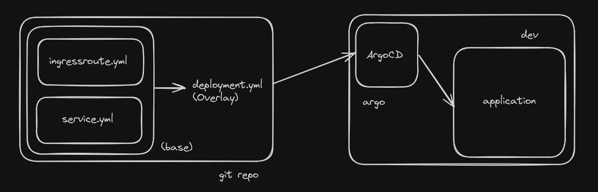
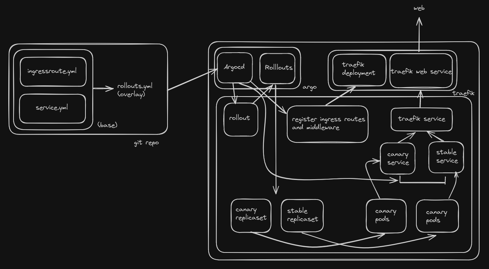

# CD GitOps Pipeline Assignment

For this assignment, I've developed a CD GitOps pipeline using ArgoCD and Argo Rollouts, deployed with Kubernetes (using Kind). The configuration management is done with Terraform. Here's a breakdown of the steps involved:

**Step 1: Kubernetes Cluster Preparation with Terraform**

I've set up a Kubernetes cluster to serve as the deployment target for our GitOps pipeline. Using Terraform, I've configured the cluster to include components like Redis statefulset with persistent volume for database storage, which will be used be the application. I have used Traefik deployment for managing ingress. Additionally, I've utilized Helm charts to install ArgoCD and Argo Rollouts using helm terraform provider. 

Room for improvement: we can integrate Teleport for secure access to Traefik, ArgoCD, and Argo Rollouts dashboards.

**Step 2: Customizing deployment yaml with Kustomize**

Using Kustomize, I've organized the deployment, service, and ingress route configurations into manageable overlays. These configurations are then applied to Kubernetes via ArgoCD, ensuring that our cluster stays synchronized with the desired state defined in our Git repository.

**Step 3: Canary Deployment Setup with Argo Rollouts**

To enable controlled canary deployments, I've converted the standard Deployment configurations into rollouts, which allow for gradual traffic shifting between different versions of our application. This approach ensures smooth transitions, minimizing disruption for end-users. 

While integrating argo rollouts with argocd I had trouble understanding the benefit of using both tools together. But I do now.
ArgoCD used deployment.yml to generate replicaset, which in turn creates pods. But with helm, we install argo rollouts operator, which observes Rollout resource instead, and controls the generation of replicasets of the stable and canary accordingly in a controlled manner.

For further improvement, we can integrate Prometheus for application health and latency monitoring, as well as conduct experiments at different stages of the rollout process to validate performance.
